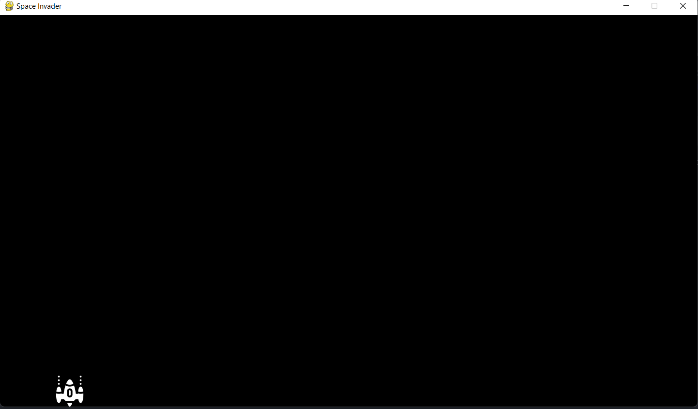
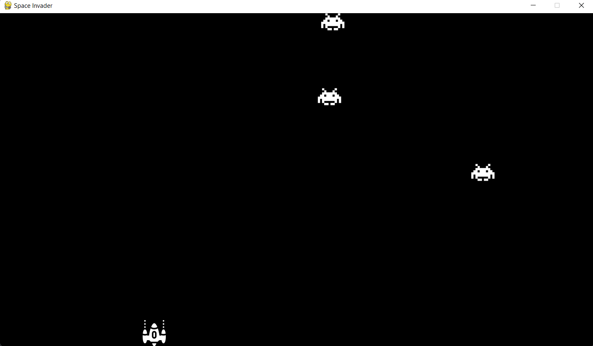

# Code step by step explaination

## Default setup (_you could automate that_)

First of all I create 3 files : `main.py`, `game.py` and `constants.py`. I copy and paste my code to get the monitor
resolution in constants.py.

## Creating the skeleton

I then go in game.py and start writing code. I create my init function. Then, I start the main function of the whole
game : `run`
There you can see the main loop which also has some default things that I copy and paste :

```python
def run(self):  # this is in game.py in the class Game
    clock = pygame.time.Clock()  # creating the clock that will help us force Frame rate
    while self.game_is_on:  # game loop
        clock.tick(FPS)  # Slows down the loop so it refreshes 60 times per second
        self.win.fill(BLACK)  # fill background
        for event in pygame.event.get():
            if event.type == pygame.QUIT:  # if you push the red cross, it close the game
                self.game_is_on = False
```

I also pasted the default code you want to have in a clean project in `main.py`:

```python
if __name__ == "__main__":
    pygame.init()
    pygame.display.set_caption("Space Invader")
    win = pygame.display.set_mode((WIDTH, HEIGHT))
    game = Game(win)
    game.run()
```

if you don't know why this s good go watch this video : [https://youtu.be/g_wlZ9IhbTs](https://youtu.be/g_wlZ9IhbTs)

## Diging into the game

### Spaceship object

Then I created the class Spaceship in the file `spaceship.py`, notice the upper case and lowercase, that is how you
usually want it to be.

Here is the basic init fonction :

```python
class Spaceship(pygame.sprite.Sprite):
    def __init__(self):
        super().__init__()
        self.surface = img_spaceship  # sprite attribute
        self.rect = self.surface.get_rect()  # sprite attribute

        self.pos = vec(0, HEIGHT)
        self.vel = vec(0, 0)
```

vec stands for vector, it is a type that I discovered recently that is basically a tuple but better. it comes from the
line in `constants.py`

```python
vec = pygame.math.Vector2
```

basically it represents the x and y composant of position or velocity.

The two main fonctions are `move` and `update`. I think they are quite important to understand.

We now have this basic window where we can move the spaceship right and left


### Ennemies

```python
class Game:
    def __init__(self):
        # some stuff
        # instanciating objects
        self.spaceship = Spaceship()
        self.all_ennemies = pygame.sprite.Group()  # list of all ennemies
```

Here is what is most important in the init method of the Game class. Every ennemy that we will add to the game will be
added to the list/group all_ennemies You can consider it as a list, the fact that it is a sprite group isn't important.
_(it is used to detect collision between objects of a certain type)_

Let's create our class first

```python
class Ennemy(pygame.sprite.Sprite):
    def __init__(self, x):
        super().__init__()

        self.surface = img_ennemy  # instantiate image to display
        self.rect = self.surface.get_rect()  # instantiate position

        self.speed = 1
        self.pos = vec(x, 0)  # spawns on top somewhere on the x axis
        self.vel = (0, self.speed)
```

dont't worry too much about pygame.sprite.Sprite being an argument and super().__init__(), just remember that these two
are linked.

We then create the basic update fonction and we add a way to make an ennemy spawn every 3sec

We're good to go. Here is what it looks like for now :

The images are a bit small and the speed of the spaceship is way to slow, let's fix that by making those thing relative
to the screen size.

## Adjustments

First I scale the images that I hade already defined to an arbitrary size that depends on the screen:

```python
# sprites
blocksize = HEIGHT // 8  # arbitrary size that depends on the screen size

x, y = pygame.image.load("assets/s.png").get_size()
img_spaceship = pygame.transform.smoothscale(pygame.image.load("assets/s.png"), (blocksize, int(blocksize * y / x)))

x, y = pygame.image.load("assets/enemy.png").get_size()
img_ennemy = pygame.transform.smoothscale(pygame.image.load("assets/enemy.png"), (blocksize, int(blocksize * y / x)))
```

then I adjust de speed of the player :
if I want him to move at 10 block per second, I do this:

`            self.speed = 10 * blocksize // FPS
`

That is a very good way in my opinion to make the speed not change when you change device or FPS

## Firing and killing ennemies


